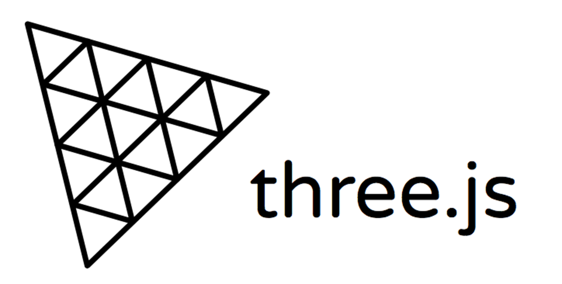
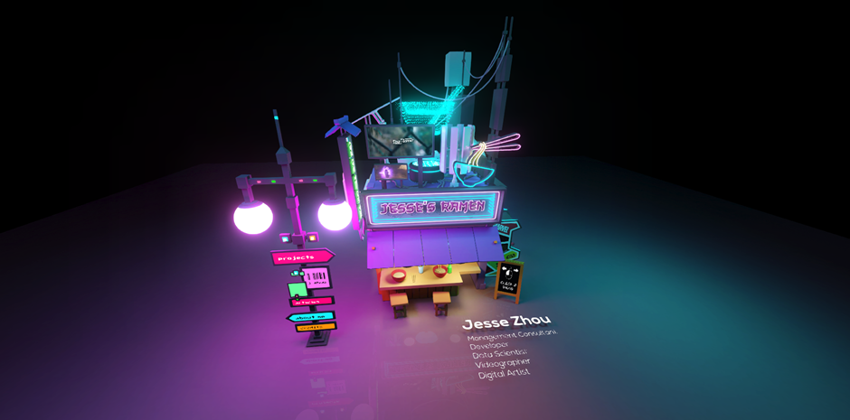
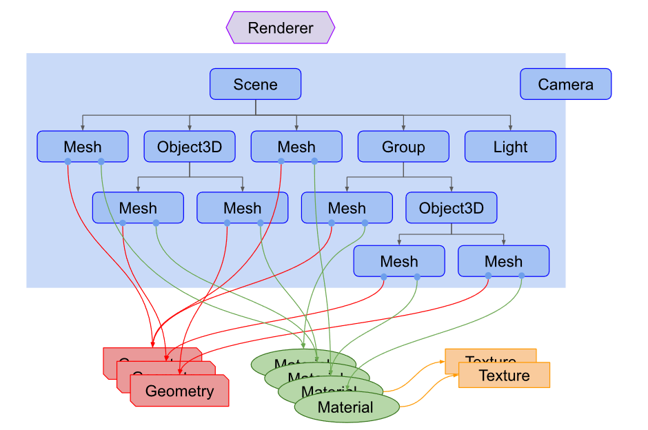

## Basic Facts:
Three.js is a popular JavaScript library used for creating 3D graphics and animations in web browsers[1][2]. Some key facts about it include:

- First released in April 2010 by Ricardo Cabello[4].
- Three.js uses WebGL to render 3D graphics using the GPU, allowing for high-performance 3D visualizations in the browser[4].
- It provides an easy-to-use abstraction layer on top of WebGL, making 3D graphics more accessible to web developers[1].
- The library includes built-in support for common 3D elements like scenes, cameras, lights, materials, geometries, and more[1][4].
- Three.js allows you to create both 3D and 2D graphics[4].
- It supports importing 3D models from popular 3D modeling software like Blender[2].
- The library includes animation capabilities, supporting techniques like keyframe animation[2].
- Three.js has built-in support for virtual and augmented reality through the WebXR API[2].
- It's open-source and has a large, active community contributing to its development[1][2].
- Three.js can be used to create a wide variety of 3D web experiences, from simple 3D models to complex interactive visualizations and games[1][3].

By leveraging Three.js, web developers can create immersive 3D experiences that run directly in the browser without requiring any plugins or special software to be installed[1][2]. This makes it a powerful tool for adding engaging 3D content to websites and web applications.

## Notes:
Competing products
- Pros/cons
- What problem does it solve

Extensions: 
Drei, React three fibre
Pre condition: node, npm

We need sample solutions to each practical tasks
Ready made ThreeJS cheat sheet by [JS MASTERY](https://drive.google.com/file/d/13tjvQ4OdPxejfE6qqSdnL_rdoVWhKYM3/view)

## Workshop structure

-	Icebreaker / ask for prior experience
-	Agenda
-	Basic information  

-	Demo portfolio/product website
-	Provide ThreeJS handout (cheat sheet)
-	Practical task 1 – Basic shapes + lighting
-	Practical task 2 - Animations 
-	Practical task 3 – load model (blender)
-	practical task 4 – load screen (optional)
-	Let them explore https://threejs.org demos
